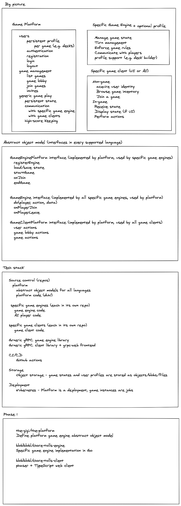

# the-platform
General-purpose platform for managing games

# Design

Check out this whiteboard discussion: 

## GameEnginePlatform interface

- RegisterEngine()
- LoadState()
- SaveState()
- StartGame()
- EndGame()
- OnJoin

